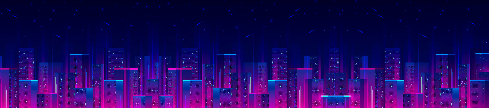

<h1 align="center">Synth of Rage (W.I.P.)</h1>

    
    
    
	

## Table of Contents

1. [Introduction](#introduction)
2. [Team](#team)
3. [Gameplay](#gameplay)
4. [Universe](#universe)
5. [Release](#release)
6. [Development](#development)
7. [Special Thanks](#special-thanks)
8. [Recommendations](#recommendations)

---

## Introduction
**Synth of Rage** is bold mix of a <u>*beat-them-all*</u> and <u>*rythm*</u> game developed by **ENSI's students of the 2027 class** over a **year-long production**, that is, around 9 months full-time.
This project is the endorsement of the **ENSI's Video Game 5-year curriculum**.

The development tried to mimic the most of the **industry standards**, including a SCRUM project management model, latest technologies and tools provided by the **Unity Engine** and the best practices in terms of design, optimizations and deployment.

---

## Team and contributions

This game was brought to life by **10 students and a handful of teachers and consultants**:

The core team responsible the concept birth and development :

- **Vincent MENEROUD**: *Product Owner* and *Lead developer*.
- **Marine AMROUCHE**: *Art Director / Lead Artist*
- **Christopher BARRERA**: *Lead Gameplay*
- **Charlie BOYER**: *SCRUM Master* and *Technical Director*

The team is also composed of a reinforcement of 6 student from the year below, who worked like a external contractor and without whom the project would not have been possible !

>   [!NOTE]
>
>   W.I.P.

The project was also supervised by the ENSI's educational team who ensured the QA role throughout the production.

>   [!NOTE]
>
>   W.I.P.

---

## Gameplay

>   [!NOTE]
>
>   W.I.P.

---

## Universe

>   [!NOTE]
>
>   W.I.P.

---

## Release
>   [!NOTE]
>
>   W.I.P.

---

## Development
This project is currently <u>**starting**</u>.

>   [!TIP]
>
>   Some updates might happen during the active development like several **playtests**.
>   You will be welcomed to try-out the game and give your opinion at such time.
>
>   Thanks for your interest and stay tuned !

---

## Special Thanks

The contributions wouldn't be complete without the support and the engagement of our friends and teachers, all of whom disserve a special thanks :
>   [!NOTE]
>
>   W.I.P.

---

## Recommendations

>   [!NOTE]
>
>   W.I.P.
